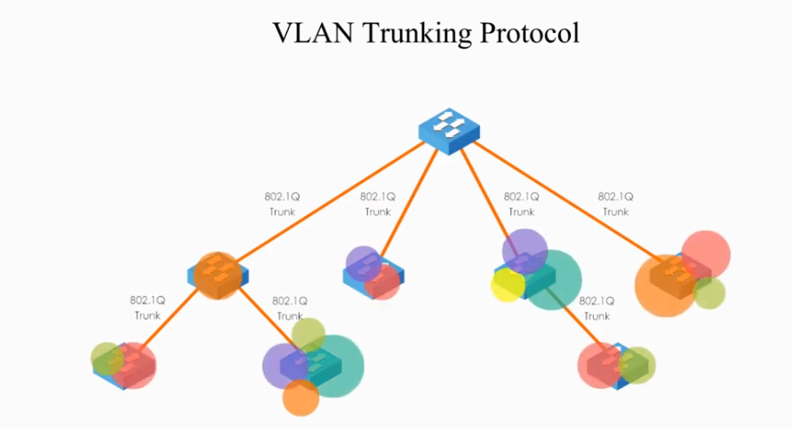
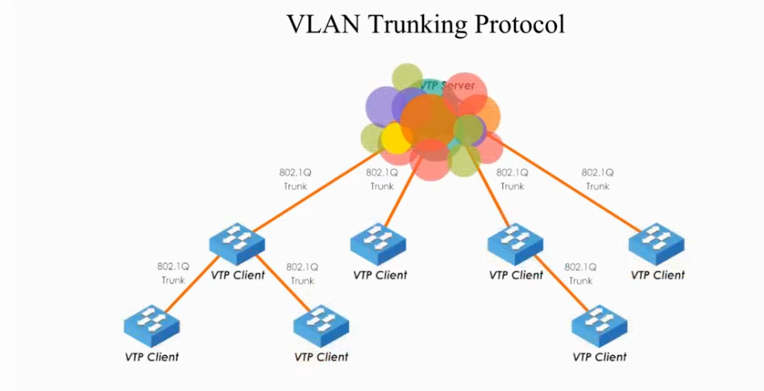
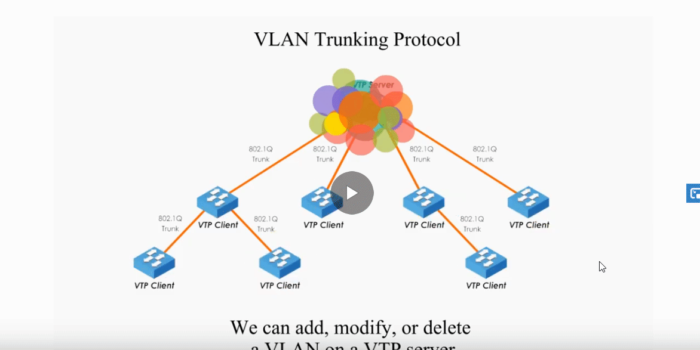
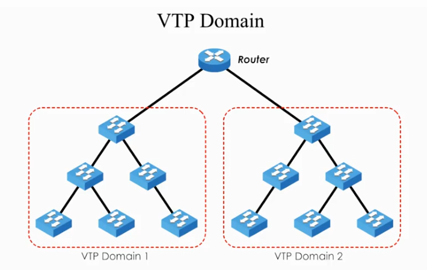
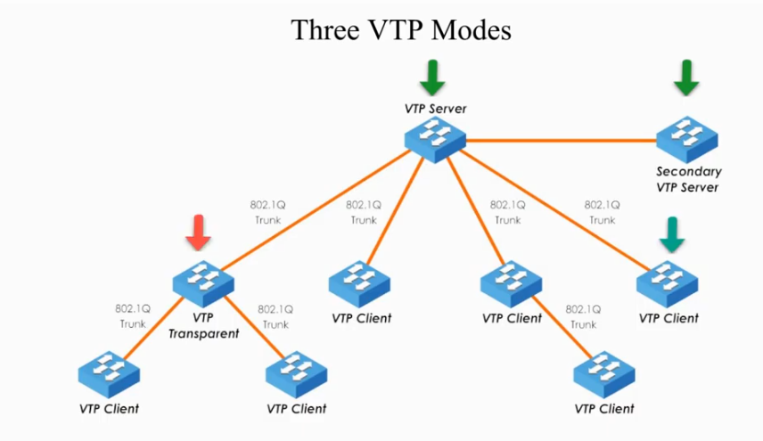
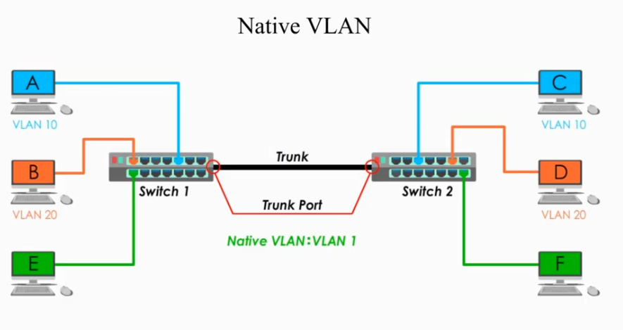
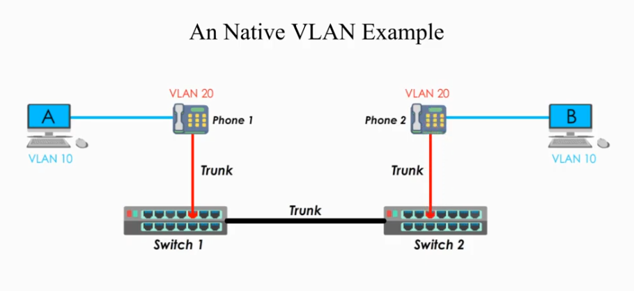

- [vlan](#vlan)
- [Co to je VLAN?](#co-to-je-vlan)
- [Na co VLANy?](#na-co-vlany)
    - [lan vs vlan rozdíl v gifu](#lan-vs-vlan-rozd%c3%adl-v-gifu)
    - [Host A pošle data přes broadcast bez vlany](#host-a-po%c5%a1le-data-p%c5%99es-broadcast-bez-vlany)
    - [Host A pošle data přes broadcast s VLANou](#host-a-po%c5%a1le-data-p%c5%99es-broadcast-s-vlanou)
- [Výhody VLAN](#v%c3%bdhody-vlan)
- [Co je to trunk(IEEE 802.1q tagging)](#co-je-to-trunkieee-8021q-tagging)
- [Shrnutí trunku](#shrnut%c3%ad-trunku)
- [IEEE802.1Q tagování](#ieee8021q-tagov%c3%a1n%c3%ad)
  - [když se rámec dostane do switche, proběhne tkzv. taggovaní](#kdy%c5%be-se-r%c3%a1mec-dostane-do-switche-prob%c4%9bhne-tkzv-taggovan%c3%ad)
- [VLAN Trunking Protocol (VTP)](#vlan-trunking-protocol-vtp)
  - [VTP doména](#vtp-dom%c3%a9na)
  - [VTP režimy](#vtp-re%c5%beimy)
- [Agregace linek](#agregace-linek)
- [Link Aggregation Control Protocol](#link-aggregation-control-protocol)
- [Native VLAN](#native-vlan)

# vlan
# Co to je VLAN?
• Virtuální LAN slouží k logickému rozdělení sítě nezávisle na fyzickém uspořádání

• pomocí VLAN můžeme síť segmentovat na menší sítě uvnitř fyzické struktury původní sítě

• obvykle bývá realizována na zařízení switch (přepínač)

• důležitou součástí je trunk – port, který je zařazen do více VLAN

• pomocí VLAN můžeme dosáhnout stejného efektu, jako když máme skupinu zařízení připojených do switche a druhou skupinu do jiného switche 
# Na co VLANy?
### lan vs vlan rozdíl v gifu

### Host A pošle data přes broadcast bez vlany

### Host A pošle data přes broadcast s VLANou

Jak vidíme tak se data dostanou jen do VLAN skupiny 1 a do druhý skupiny ( kde je HOST D) se nedostanou..
Stručněji řečeno, ty síťová zařízení se rozdělí do skupin a data se dostanou jen do pc v dané skupině...

Co se stane když host A z VLAN10 se pokusí poslat data do VLAN20?

Dále se pozmění trochu ip adresa

Dále se na switchi nastaví porty pro vlany aby se komunikovalo jen v ty daný skupině(vlaně)...
VLAN se vytváří na switchi pomocí přiřazení portů na switchi ke konkrétní síti VLAN.

# Výhody VLAN
• Oddělení speciálního provozu.
> ..

• zjednodušená správa 
>k přesunu zařízení do jiné sítě stačí překonfigurovat zařazení do VLANy => správce konfiguruje SW a ne HW (fyzické přepojení)

• snížení HW 
> různé podsítě mohou být na stejném switchi 

• snížení broadcastů 
>hlavní výhodou VLAN je vytvoření více, ale menších, broadcastových domén => zlepšení výkonu sítě snížením provozu (traffic)

• zvýšení zabezpečení 
> oddělení komunikace do speciální VLANy, kam není jiný přístup 
(Dáme portu určitý číslo a žádný jiný port přes něj neprojde)

# Co je to trunk(IEEE 802.1q tagging)
• označován také jako trunking protocol nebo dot1q tagging

• standardizovaná metoda, kterou podporují všechny moderní switche s podporou VLAN

Jak uděláme, aby B na switchi 1 komunikoval s D na switchi 2? (viz. obrazek)

Toto se vyřeší pomocí tzv. trunku

Tento proces spojování ruzných komunikací VLAN pomoci trunků se nazývá trunkování.

Trunkování funguje díky Trunk portu 

Trunk port přidá VLAN tag do ethernetovýho rámce aby identifikoval do jaké VLAN síťe ten rámec patří...

Access port(přistupový port) = přenáší provoz pouze pro jednu VLAN 

# Shrnutí trunku
Jestliže chceme, aby různé VLANové komunikace cestovali skrz 2 switche, potřebujeme trunk.

Trunk je vytvořen konfigurací trunk portů.

Trunk port vyšle (nebo očekává že dostane) tagovanou komunikaci.

Access port pošle (nebo očekává že dostane) netagovanou komunikaci.

# IEEE802.1Q tagování
## když se rámec dostane do switche, proběhne tkzv. taggovaní 

Princip taggovaní:
>Hlavička originálního rámce je rozšířena o 4B informaci, první značka je protokol 802.1q, dále následuje priorita dle protokolu, příznak a poslední je číslo VLAN

> protože se změní data, je třeba přepočítat kontrolní součet na konci rámce 

Teď mými slovy:

Když pc A pošle do switche ethernetový rámec, rámec má zdrojovou a cílovou adresu atd., ale neobsahuje žádné informace o VLANě.

Důvodem je to, že počítač nemá tušení že nějaká VLANa existuje a ani nemusí.

Tvorba a řízení VLANy je všechno úkol switche.

Když switch 1 dostane ethernetový rámec od pc A, ví že přišel od pc A, který patří do VLAN 10.

Proto musí poslat tento rámec dalšímu členovy skupiny VLAN 10, který se nachází na switchi 2... takže musí poslat přes trunk xD

Před tím než pošle přes ten trunk, musí udělat jednu duležitou věc!!!!

To jest vložení VLAN tagu do rámce.

Tento záhadná tag se dělí na 4 části

•první značka je protokol 802.1q

•dále následuje priorita dle protokolu

•příznak 

•a poslední je číslo VLAN (identifikátor)

OK, teď když se vložila nová část to Ethernetovýho rámce, tak už to není Ethernetový, ale je to IEEE 802.1q rámec

Nyní se pošle přes trunk, jupí!! Jak to ale vypadá uvnitř trunku?

Můžeme si představit trunk jako silnici, každý pruh silnice patří jiný VLAN komunikaci.

Teď dorazil tagovanej rámec do switche 2 !!

Switch 2 ví z toho tagu, že ho má poslat po VLAN10 počítači C.

ALE POZOR!!!!!

U shrnutí trunku jsem řekl že: "Access port pošle (nebo očekává že dostane) netagovanou komunikaci."

To znamená že switch 2 zahotí ten VLAN tag a pošle originální Ethernetový rámec počítači C.....

KONEC TAGOVÁNÍ !! :)
# VLAN Trunking Protocol (VTP) 
> síťový protokol společnosti Cisco, který zajišťuje přenášení čísel a názvů virtuálních LAN (VLAN) mezi přepínači zařazených do jedné domény  

> spravuje přidávání, mazání a přejmenování VLAN uvnitř VTP domény  

> VTP doména je tvořena jedním nebo více síťovými zařízeními, která mají nastaveno stejné jméno domény (volitelně i heslo) a jsou propojeny pomocí trunku 

Takto by vypadal sít bez VTP, museli bychom spravovat a konfigurovat všechny switche najednou a to by byla nejen časově náročné, ale hodněkrát i lehké na chybování.

Díky tomuto protokolu můžeme vytvářet VLANy na jednom SERVER switchi a všechny ostatní CLIENT switche se musí centralizovat sami.

Na VTP Serveru můžeme tedy přidat, upravit nebo odstranit VLAN.

Poté co jsme hotovi s úpravami, server pošle všechny tyto konfigurace do ostatních VTP klientů (v jedné stejné VTP doméně samozřejmě)

## VTP doména

Všechny switche v jedné doméně sdílí stejná VLAN nastavení!!

VTP doména nemůže fungovat bez pojmenování! Proto se nastavuje jméno domény při první konfiguraci.

Všechny switche v doméně můsíme nastavit na stejné jméno jako název domény.

## VTP režimy

Jsou tedy 3 režimy: VTP server, klient a transparent

# Agregace linek
> metody kombinování (agregace) více síťových připojení => zvýšení propustnosti a záruka funkčnosti, jestli jedna linka selže

> aplikována na 3 nejnižších vrstvách ISO/OSI

> zatížení rovnoměrně rozložené na všechny linky

> rozhraní sdílí jednu logickou adresu (IP), nebo jednu fyzickou adresu (MAC) nebo má každé rozhraní svoji vlastní adresu 

# Link Aggregation Control Protocol 

> LACP nabízí metodu kontroly svazku několika fyzických portů, které dohromady vytváří jediný logický kanál

> umožňuje síťovému zařízení sjednat automatické svázání linek, pomocí odeslání paketů peeru

# Native VLAN 

> nastavuje se na trunk portu (port, který je zařazen do více VLAN)

> u Cisco prvků musíme nativní VLANu vždy nastavit, a to shodně na obou stranách trunku

> provoz, který je zařazen do native VLAN se při přenosu netaguje (zůstává nezměněn) a příchozí provoz, který není tagovaný se zařazuje do native VLAN

> často se jako native VLAN nastavuje management VLAN 

Prostě je to speciální VLAN, u který komunikace přes trunk není tagovaná 

Defaultní VLAN normálně je VLAN1

Na obrázku pc E a F nejsou přiřazeny k žádnýmu VLANU a proto jsou defaultně patří do VLAN1

A když pc E pošle rámec počítači F, tak může cestovat přes trunk beztoho aniž by měl VLAN tag.

Proto bychom ho měli změnit na něco jinýho než 1, jinak riskujem že nás hacknou ... :/

Native VLAN (defaultní) by měl být stejný na obou koncí trunku!!! jinak se ti to celý pojebe

Na obrázku je takovej příklad kde je native VLAN užitečný

Funguje to tak že PC je připojený k IP telefonu a ten k switchi...

No a když to chceme takhle tak můžeme nastavit Native VLAN na VLAN 10 a tím pádem bude rámec z PC1 cestovat až do PC2 bez tagování(všichni ho pustí, i telefon protože ten má zas nějakej pofiderní switch v sobě a očekává jen tagovanej rámec, takže ten netagovanej ho nezajímá). 

A když ip telefon pošle, tak bude tagovanej a switch ho pošle kam patří.

Takže se Native VLAN hodí pro to když datovej VLAN a hlasovej VLAN sdílí stejnou linku 

